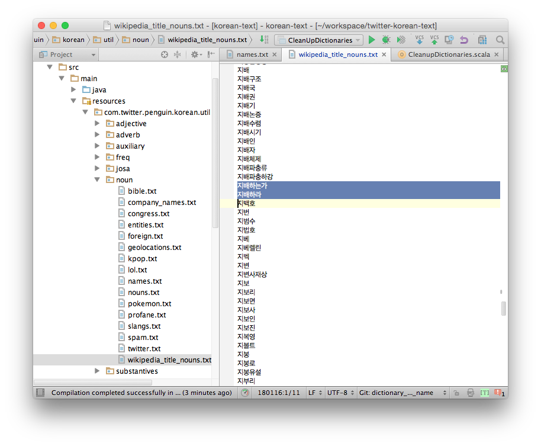
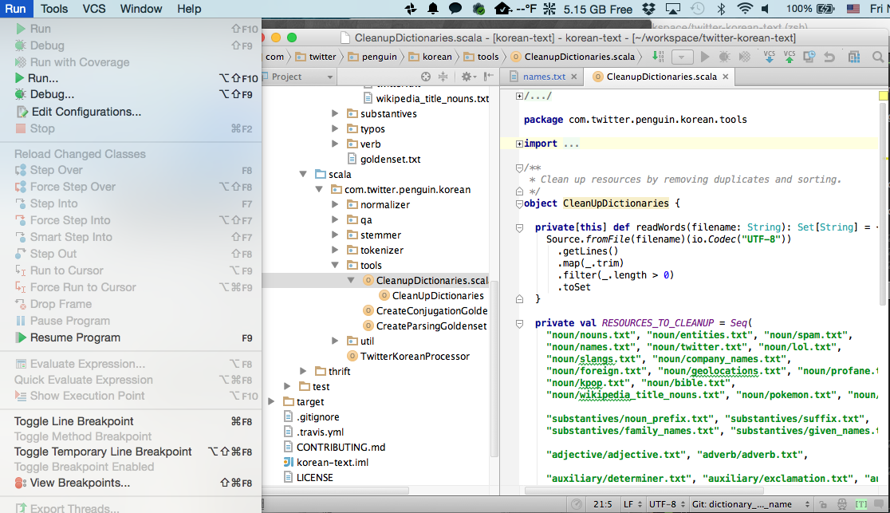
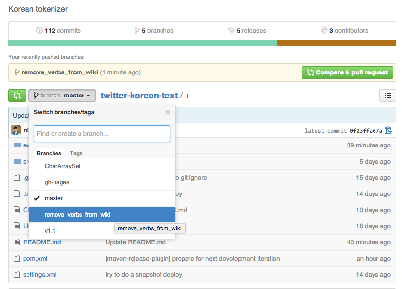

github에서 clone해서 설치하고 사전을 업데이트 하고 pull request를 보내는 방법을 연습해 보도록 하겠습니다.

# 개발 환경 설치

* Scala를 설치해 주세요. [http://www.scala-lang.org/download/](http://www.scala-lang.org/download/)
* IntelliJ Idea를 설치해 주세요. [https://www.jetbrains.com/idea/download/](https://www.jetbrains.com/idea/download/)
* 설치 후에는 Scala Plugin을 설치해 주세요. 환경 설정에 있습니다.
* GitHub repo를 Clone해 주세요.
* Terminal에서 ```git clone https://github.com/twitter/twitter-korean-text.git``` 을 해 주시면 됩니다. 물론 git도 설치 되어 있어야 겠죠?
* Intellij Idea에서 ```pom.xml``` 파일을 열어 주세요.

# Branch를 만들어서 사전을 수정하고 업데이트 하기

## Git Branch 만들기

git checkout -b "feature_branch_name"

"feature_branch_name"에 브랜치 이름을 넣습니다. 이 예제에서는 remove_verbs_from_wiki으로 이름지었습니다.

## 코드 업데이트

이 예제에서는 사전을 수정해 보겠습니다. 사전 파일들은 

[src/main/resources/com/twitter/penguin/korean/util/](../../../tree/master/src/main/resources/com/twitter/penguin/korean/util) 에 있습니다. 

```src/main/resources/com/twitter/penguin/korean/util/noun/wikipedia_title_nouns.txt``` 에 동사가 들어가 있네요. 삭제했습니다. (이런 경우가 많이 있습니다. 수작업으로 없애 주어야 하는데요 여러분의 도움을 구합니다. 아울러 복합명사도 최대한 분리 되어야 합니다. 하동청룡리석불좌상 -> 하동 청룡리 석불 좌상)



사전을 정리하기 위해서 [src/main/scala/com/twitter/penguin/korean/tools/CleanupDictionaries.scala](../../../tree/master/src/main/scala/com/twitter/penguin/korean/tools/CleanupDictionaries.scala) 를 실행합니다.

파일을 열고 Run > Run... 을 실행합니다.




사전 파일이 가나다 순으로 정렬됩니다.

## 변경 내용 확인

* 무엇이 변경되었나 확인해 보겠습니다. 
```
~/workspace/twitter-korean-text remove_verbs_from_wiki* ➜  git diff

diff --git a/src/main/resources/com/twitter/penguin/korean/util/noun/wikipedia_title_nouns.txt b/src/main/resources/com/twitter/penguin/korean/util/noun/wikipedia_title_nouns.txt
index 8a6d3c5..c1386d3 100644
--- a/src/main/resources/com/twitter/penguin/korean/util/noun/wikipedia_title_nouns.txt
+++ b/src/main/resources/com/twitter/penguin/korean/util/noun/wikipedia_title_nouns.txt
@@ -1183,8 +1183,6 @@
 가야정
 가야정류장
 가야트리
-가야하나
-가야하는가
 가야합동버스정류장
 가약스
 가얄
@@ -43852,7 +43850,6 @@
 뒬랭
 뒬롱
 뒬링
-뒷담잘하는윤씨
 뒷면
 뒷세상
 뒷어금니
@@ -47547,6 +47544,7 @@
 라히모프
 라히즈
 라힘
+락
 락검
 락다운
 락도역
@@ -51348,6 +51346,7 @@
 로힝야
 로힝야인
 로힝야족
+록
 록기
 록내장
 록둔도
@@ -51412,6 +51411,7 @@
 록티
 록퍼드
 록페
+록페스티벌
 록펠러
 록포트
 록하트
@@ -93029,7 +93029,6 @@
 산차
 산책길
 산책로
-산책하는개
 산척면
 산척역
 산천단
@@ -112092,7 +112091,6 @@
 승천
 승천일
 승천태후
-승천하는미꾸리
 승천황태후
 승탑
 승탑군

...
```

* 테스트를 실행해 봅니다. 

~/workspace/twitter-korean-text remove_verbs_from_wiki* ➜  mvn test
```
Picked up _JAVA_OPTIONS: -Xmx2g
[INFO] Scanning for projects...
[WARNING]
[WARNING] Some problems were encountered while building the effective model for com.twitter.penguin:korean-text:jar:2.1.2-SNAPSHOT
[WARNING] 'build.plugins.plugin.version' for org.apache.maven.plugins:maven-compiler-plugin is missing. @ line 187, column 15

...


-------------------------------------------------------
 T E S T S
-------------------------------------------------------
Picked up _JAVA_OPTIONS: -Xmx2g
Running com.twitter.penguin.korean.normalizer.KoreanNormalizerTest
Tests run: 10, Failures: 0, Errors: 0, Skipped: 0, Time elapsed: 1.574 sec
Running com.twitter.penguin.korean.stemmer.KoreanStemmerTest
Tests run: 4, Failures: 0, Errors: 0, Skipped: 0, Time elapsed: 0.783 sec
Running com.twitter.penguin.korean.tokenizer.KoreanChunkerTest
Tests run: 2, Failures: 0, Errors: 0, Skipped: 0, Time elapsed: 0.012 sec
Running com.twitter.penguin.korean.tokenizer.KoreanTokenizerTest
Tests run: 16, Failures: 0, Errors: 0, Skipped: 0, Time elapsed: 0.214 sec
Running com.twitter.penguin.korean.TwitterKoreanProcessorJavaTest
Tests run: 6, Failures: 0, Errors: 0, Skipped: 0, Time elapsed: 0.055 sec
Running com.twitter.penguin.korean.TwitterKoreanProcessorTest
Goldenset Match Error: 가야하나요 (가야하나Noun 요Josa) -> (가다Verb)
Goldenset Match Error: 가야하나 (가야하나Noun) -> (가야Noun 하나Noun)
Goldenset Match Error: 락이가 (락이Noun* 가Josa) -> (락Noun 이Suffix 가Josa)
Nov 14, 2014 9:43:51 PM com.twitter.penguin.korean.TwitterKoreanProcessorTest$$anonfun$12 apply$mcV$sp
INFO: Parsed 42496 chunks.
       Total time: 4843 ms
       Average time: 0.11 ms
       Max time: 15 ms, 불러주시면
Tests run: 12, Failures: 0, Errors: 1, Skipped: 0, Time elapsed: 5.884 sec <<< FAILURE!
tokenize should correctly tokenize the goldenset(com.twitter.penguin.korean.TwitterKoreanProcessorTest)  Time elapsed: 5.637 sec  <<< ERROR!

...


Results :

Tests in error:
  tokenize should correctly tokenize the goldenset(com.twitter.penguin.korean.TwitterKoreanProcessorTest): {(..)

Tests run: 66, Failures: 0, Errors: 1, Skipped: 0

[INFO] ------------------------------------------------------------------------
[INFO] BUILD FAILURE
[INFO] ------------------------------------------------------------------------
```

테스트가 Fail하였습니다. 기존 코드와의 변화를 확인하기 위해서 5만개 정도의 어절을 test set으로 넣어 놓았습니다. 
```
Goldenset Match Error: 가야하나요 (가야하나Noun 요Josa) -> (가다Verb)
Goldenset Match Error: 가야하나 (가야하나Noun) -> (가야Noun 하나Noun)
Goldenset Match Error: 락이가 (락이Noun* 가Josa) -> (락Noun 이Suffix 가Josa)
```
이 부분을 복사해 놓아 주세요. 나중에 코드 Review할 때 유용합니다.


* 변화한 예시가 acceptable하면 Goldenset을 업데이트 합니다.
[src/main/scala/com/twitter/penguin/korean/tools/CreateParsingGoldenset.scala](../../../tree/master/src/main/scala/com/twitter/penguin/korean/tools/CreateParsingGoldenset.scala) 파일을 실행하면 goldenset을 자동으로 업데이트 합니다. (IntelliJ 안에서 실행 해 주세요.)

* 다시 테스트를 실행해 봅니다.
```
-------------------------------------------------------
 T E S T S
-------------------------------------------------------
Picked up _JAVA_OPTIONS: -Xmx2g
Running com.twitter.penguin.korean.normalizer.KoreanNormalizerTest
Tests run: 10, Failures: 0, Errors: 0, Skipped: 0, Time elapsed: 1.508 sec
Running com.twitter.penguin.korean.stemmer.KoreanStemmerTest
Tests run: 4, Failures: 0, Errors: 0, Skipped: 0, Time elapsed: 0.771 sec
Running com.twitter.penguin.korean.tokenizer.KoreanChunkerTest
Tests run: 2, Failures: 0, Errors: 0, Skipped: 0, Time elapsed: 0.013 sec
Running com.twitter.penguin.korean.tokenizer.KoreanTokenizerTest
Tests run: 16, Failures: 0, Errors: 0, Skipped: 0, Time elapsed: 0.236 sec
Running com.twitter.penguin.korean.TwitterKoreanProcessorJavaTest
Tests run: 6, Failures: 0, Errors: 0, Skipped: 0, Time elapsed: 0.063 sec
Running com.twitter.penguin.korean.TwitterKoreanProcessorTest
Nov 14, 2014 9:52:40 PM com.twitter.penguin.korean.TwitterKoreanProcessorTest$$anonfun$12 apply$mcV$sp
INFO: Parsed 42496 chunks.
       Total time: 5166 ms
       Average time: 0.12 ms
       Max time: 65 ms, 들리는게
Tests run: 12, Failures: 0, Errors: 0, Skipped: 0, Time elapsed: 6.387 sec
Running com.twitter.penguin.korean.util.HangulTest
Tests run: 8, Failures: 0, Errors: 0, Skipped: 0, Time elapsed: 0.008 sec
Running com.twitter.penguin.korean.util.KoreanConjugationTest
Tests run: 2, Failures: 0, Errors: 0, Skipped: 0, Time elapsed: 0.398 sec
Running com.twitter.penguin.korean.util.KoreanSubstantiveTest
Tests run: 6, Failures: 0, Errors: 0, Skipped: 0, Time elapsed: 0.004 sec

Results :

Tests run: 66, Failures: 0, Errors: 0, Skipped: 0

[INFO] ------------------------------------------------------------------------
[INFO] BUILD SUCCESS
[INFO] ------------------------------------------------------------------------
```

성공하였습니다.

## Commit & Push

~/workspace/twitter-korean-text remove_verbs_from_wiki* ➜  git commit -am "dictionary update"
[dictionary_update_name 8dffbfc] dictionary update
 2 files changed, 8 insertions(+), 41 deletions(-)
 rewrite src/test/resources/com/twitter/penguin/korean/util/goldenset.txt.gz (61%)
~/workspace/twitter-korean-text remove_verbs_from_wiki ➜  git push origin remove_verbs_from_wiki
Counting objects: 20, done.
Delta compression using up to 8 threads.
Compressing objects: 100% (10/10), done.
Writing objects: 100% (20/20), 578.94 KiB | 0 bytes/s, done.
Total 20 (delta 4), reused 0 (delta 0)
To git@github.com:twitter/twitter-korean-text.git
 * [new branch]      remove_verbs_from_wiki -> remove_verbs_from_wiki


## Merge with master
10. GitHub에 Branch가 생겼습니다.



"Compare & pull request"를 누르면 Pull Request를 보낼 수 있습니다.
